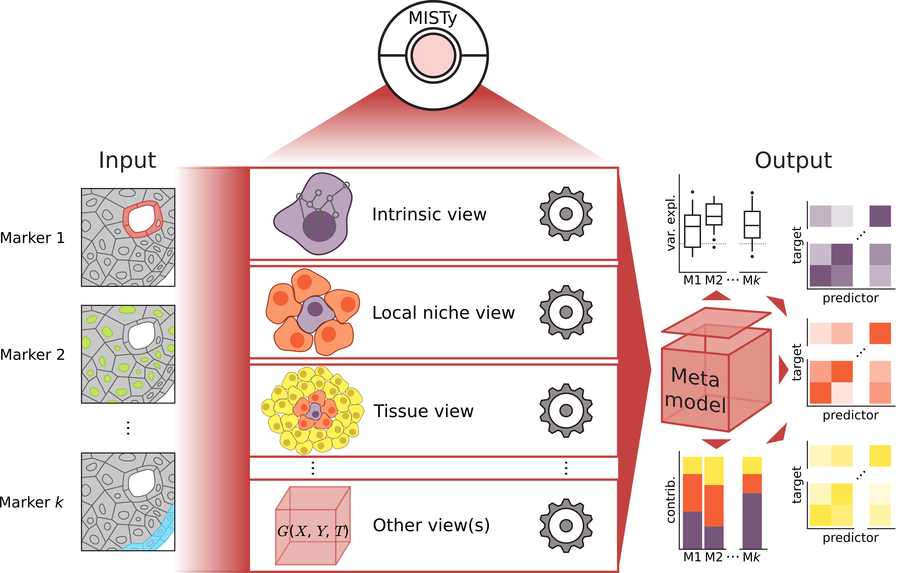

# MISTy - **M**ultiview **I**ntercellular **S**pa**T**ial modeling framework 

<!-- badges: start -->
<!-- badges: end -->

## Overview

The advancement of technologies for measurement of highly multiplexed spatial data require the development of scalable methods that can leverage the availability of the spatial context. Multiview Intercellular SpaTial modeling framework (MISTy) is an explainable machine learning framework for knowledge extraction and analysis of single-cell, highly multiplexed, spatially resolved data.



MISTy facilitates an in-depth understanding of marker interactions by profiling the intra- and intercellular relationships. MISTy is a flexible framework able to process a custom number of views. Each of these views can describe a different spatial context, i.e., define a relationship among the observed expressions of the markers, such as intracellular regulation or paracrine regulation. However, the views can also capture cell-type specific relationships, capture relations between functional footprints or focus on relations between different anatomical regions. Each MISTy view is considered as a potential source of variability in the measured marker expressions. Each MISTy view is then analyzed for its contribution to the total expression of each marker and is explained in terms of the interactions with other measurements that led to the observed contribution. Our approach is modular, easily parallelizable and thus scalable to samples with millions of cells and thousands of measured markers.


## Installation

Install from GitHub using devtools.

```r
# install.packages("devtools")
devtools::install_github("saezlab/misty")

```

## Usage

Example pipelines and synthetic data for running MISTy are available from [this repository](https://github.com/saezlab/misty_pipelines/).

## Citation
If you use MISTy for your research please cite the [following publication](): 

> Jovan Tanevski, Attila Gabor, Ricardo Omar Ramirez Flores, Denis Schapiro, Julio Saez-Rodriguez. Explainable multi-view framework for dissecting inter-cellular signaling from highly multiplexed spatial data. In preparation. (2020).
